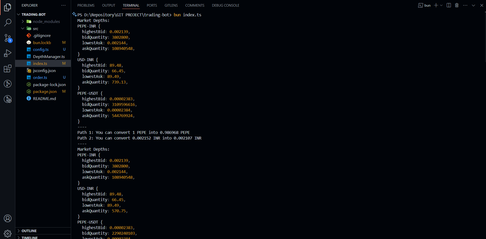
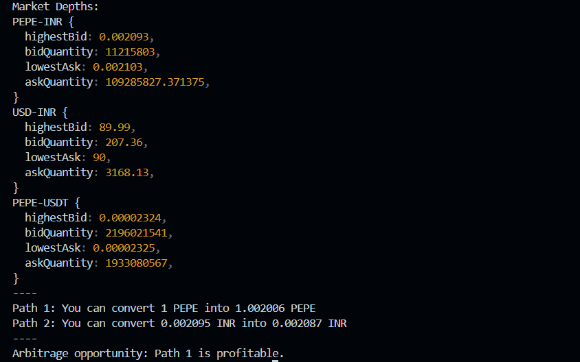

# 🚀 **Crypto Arbitrage Trading Bot**


A **crypto arbitrage trading bot** designed to identify and take arbitrage opportunities across different trading pairs and markets. This bot continuously monitors market depths and executes trades automatically when profitable paths are detected, considering trading fees.

---

## 🌟 **Features**

### 1. **Market Monitoring**

- **Tracks Depths**:
  - Fetches live order book data for the following trading pairs:
    - `PEPE-INR`
    - `USDT-INR`
    - `PEPE-USDT`
  - Captures both **lowest ask** and **highest bid** prices.
- **Validates Market Data**:
  - Ensures that the fetched data is valid and non-zero to avoid errors.

### 2. **Arbitrage Detection**

- **Path 1**: `PEPE → INR → USDT → PEPE`
  - Detects arbitrage opportunities to cycle PEPE back to PEPE profitably.
- **Path 2**: `INR → USDT → PEPE → INR`
  - Identifies opportunities to convert INR back to INR with a profit.

### 3. **Profitability Calculation**

- Automatically accounts for trading fees (**0.6% per trade**) in all calculations:
  - Adjusts bid/ask values for more accurate profitability estimation.

### 4. **Order Execution**

- Executes a sequence of trades when an arbitrage opportunity is identified:
  - **Buy/Sell PEPE, USDT, and INR** in respective markets.
  - Ensures the correct precision (e.g., USDT with 2 decimal places).
- Dynamically calculates and rounds trade amounts as required by the exchange API.

### 5. **Logging and Error Handling**

- Logs every arbitrage calculation and trade execution result.
- Skips invalid market data and gracefully handles API errors.

---

## 🛠 **Tools & Technologies**

| Tool                | Purpose                                                             |
| ------------------- | ------------------------------------------------------------------- |
| **API Used**        | **CoinDCX** - `https://api.coindcx.com`;                            |
| **Node.js**         | Backend runtime environment for executing the bot.                  |
| **TypeScript**      | Ensures type safety and prevents runtime errors.                    |
| **Custom Modules**  | Handles market depth, order management, and precision calculations. |
| **API Integration** | Interfaces with the exchange to fetch live data and execute trades. |
| **console.log**     | Logs trade activity and profit/loss opportunities.                  |

---

## ⚙️ **How It Works**

1. **Setup**:
   - Clone the repository.
   - Install dependencies:
     ```bash
     npm install
     ```
2. **Run the Bot**:  
   Start the bot with:
   ```bash
   npm start
   ```

## 📊 Trading Workflow

### 🔄 Arbitrage Paths

| Path  | Workflow                 | Profit Metric |
| ----- | ------------------------ | ------------- |
| **1** | PEPE → INR → USDT → PEPE | Extra PEPE    |
| **2** | INR → USDT → PEPE → INR  | Extra INR     |

### 🔑 Key Steps in Each Arbitrage Path:

1. Fetch **real-time market depth**.
2. Compute **adjusted bid/ask prices** considering fees.
3. Identify if the cycle generates a **profit**.
4. Execute a series of **market orders** to lock in the arbitrage profit.

---

## 🧮 Example Arbitrage Calculation

### **Path 1**: `PEPE → INR → USDT → PEPE`

| Step            | Input Price          | Adjusted Price (0.6% Fee) | Conversion             |
| --------------- | -------------------- | ------------------------- | ---------------------- |
| **PEPE → INR**  | 1 PEPE = ₹5          | ₹5.03                     | ₹5.03                  |
| **INR → USDT**  | ₹5.03 = $0.06        | $0.05964                  | $0.05964               |
| **USDT → PEPE** | $0.05964 = 0.99 PEPE | 0.99 PEPE                 | **Profit: -0.01 PEPE** |

### **Path 2**: `INR → USDT → PEPE → INR`

| Step            | Input Price           | Adjusted Price (0.6% Fee) | Conversion        |
| --------------- | --------------------- | ------------------------- | ----------------- |
| **INR → USDT**  | ₹1 = $0.012           | $0.01193                  | $0.01193          |
| **USDT → PEPE** | $0.01193 = 0.002 PEPE | 0.002 PEPE                | 0.002 PEPE        |
| **PEPE → INR**  | 0.002 PEPE = ₹1.02    | ₹1.02                     | **Profit: ₹0.02** |

---

## 🔒 Precision Management

- Ensures that all orders meet the exchange's **precision requirements**:
  - **USDT**: 2 decimal places.
  - **Other currencies**: Based on exchange rules.
- Uses `toFixed()` to round order amounts dynamically.

---

## 📄 File Structure

```bash
📂 project-root/
├── 📄 DepthManager.ts       # Handles fetching and processing market depths.
├── 📄 order.ts              # Manages order creation and cancellation.
├── 📄 index.ts              # Main entry point for the trading bot.
├── 📄 README.md             # Project documentation (this file).
├── 📄 .gitignore            # Specifies files/folders to ignore in Git.
├── 📂 assets/               # Contains project assets.
    └── 📂 screenshots/      # Screenshots of the bot in action.
```

---

## 💡 Future Enhancements

- **Multiple Exchange Support**:
  - Extend the bot to work across multiple exchanges.
- **Advanced Arbitrage Strategies**:
  - Implement more complex arbitrage paths.
- **Risk Management**:
  - Add stop-loss and take-profit mechanisms.
- **User Interface**:
  - Develop a web interface for monitoring and controlling the bot.

---

## Screenshots

### **Market Monitoring**



